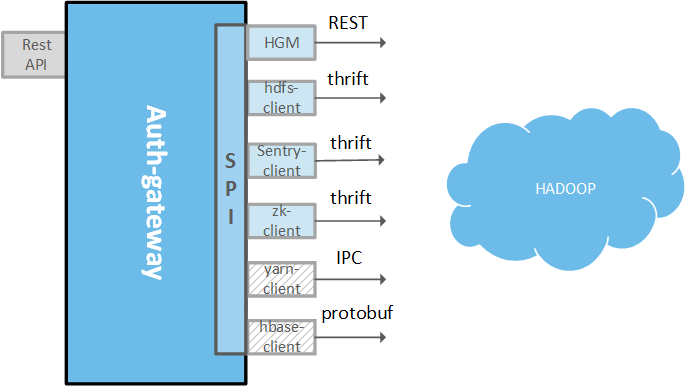

#Auth-gateway
A gateway for adding and removing authorization data for hadoop components.


## General description

When adding a new organization or a new user to TAP platform, there are many steps to perform. Reason of creating Auth-gateway is to keep one point that should be called during manipulations over collections of orgs and users. Auth-gateway will make calls to all Hadoop components in order to keep authorization information in sync. Auth-gateway is accessible via REST API and exposes 4 operations.

* Add organization
* Delete organization
* Add user to organization
* Remove user from organization



Because of different authorization methods and communication protocols of Hadoop elements, Auth-gateway has two types of components.
* **Auth-gateway providers** - responsible for performing changes in authorization structure in one Hadoop element, for instance: changing Access Control Lists in Zookeeper.
* **Auth-gateway engine** - responsible for invoking gateway providers in parallel manner.


### Gateway engine description

Gateway-engine uses CompleatableFuture to handle parallel invocation of providers and timeouts. It utilize some kind of barrier to wait on end of execution of all providers. If any provider fails, engine logs and returns an error. Error message is proxied to the client.

### Providers description

#### Hdfs provider
Hdfs provider is an optional part of the gateway, which is responsible for creating several directories on hdfs like:

* /org/org_name/ - organization directory - permissions set for user org_admin
* /org/org_name/tmp - temporary directory - permissions set for group org
* /org/org_name/broker - broker directory - permissions set for user org_admin
* /org/org_name/users/ - users directories - permissions set for user org_admin
* /org/org_name/users/user_name - directory for each user in organization - permissions set for user

* **Configuration with Kerberos**
  Kerberos mode requires providing keytab file as base64 in HDFS_KEYTAB environment variable and HDFS_SUPERUSER which is superuser in hdfs.
  
* **Configuration without Kerberos**
  
  When hdfs provider running without kerberos it not require HDFS_KEYTAB, HDFS_SUPERUSER will be used as a name of superuser in hdfs.

#### Zookeeper provider

Zookeeper provider works differently in kerberos and non-kerberos environment.
* **Without kerberos**

  It creates znodes (one per single organization) but it didn't set any ACLs. Kerberos-less environment is unrecommended if you are aiming for security.

* **With kerberos**

  It creates znodes (one per single organization) just like on the non-kerberos environment, but it also secure it with ACLs. Only super-user has access to newly created userless organization. During adding user to organization, zookeeper provider will add this user to ACL of his organization znode. 
  
  ACLs used by zookeeper provider are based on SASL authentication scheme.


## Configuration and deployment

##### Build and manifest generation
```mvn clean package```

##### Prerequisities
You need to create zookeeper instance with plan "bare". It's name should be equal to the name defined in ```auth-gateway-engine/manifest.yml``` file which is generated during build from ```auth-gateway-engine/src/cloudfoundry/manifest.yml``` file.

You can create such service instance with cf-cli:

```cf cs zookeeper bare zk-inst-plan-bare```

Then, you can push application to the Cloud Foundry:

```cd auth-gateway-engine```

```cf push```


## Calling Auth-gateway with REST API

* Create organization

  Path: ```/organizations/{orgID}?orgName={orgName}```
  
  Method: PUT
  
* Delete organization

  Path: ```/organizations/{orgID}?orgName={orgName}```
  
  Method: DELETE
  
* Add user to organization

  Path: ```/organizations/{orgID}/users/{userID}```
  
  Method: PUT
  
* Remove user from organization

  Path: ```/organizations/{orgID}/users/{userID}```
  
  Method: DELETE


## Development

Testing:
```mvn clean test```

Building executable jar:
```mvn clean package```


### Creating new provider

* Create new sub-project. Call it ```<component>-auth-gateway``` where ```<component>``` is an element of hadoop you want to be called by auth-engine.
* Add this sub-project to modules section in pom.xml.
* Implement ```org.trustedanalytics.auth.gateway.spi.Authorizable``` interface.
* Create configuration class. It should be annotated with ```org.springframework.context.annotation.Configuration``` and be placed in ```org.trustedanalytics.auth.gateway.*``` package. It is also recommended to use ```org.springframework.context.annotation.Profile``` annotation with ```<component>-auth-gateway``` as argument.
* In configuration class place Bean factory method annotated with ```org.springframework.context.annotation.Bean```. This method should return your Authorizable implementation ready to use.
* In auth-gateway-engine add dependency to your sub-project.
* Modify src/cloudfoundry/manifest.yml in auth-gateway-engine if your provider need any external configuration. At least you should add ```<component>-auth-gateway``` to comma-separated lists of active Spring profiles: ```SPRING_PROFILES_ACTIVE```.